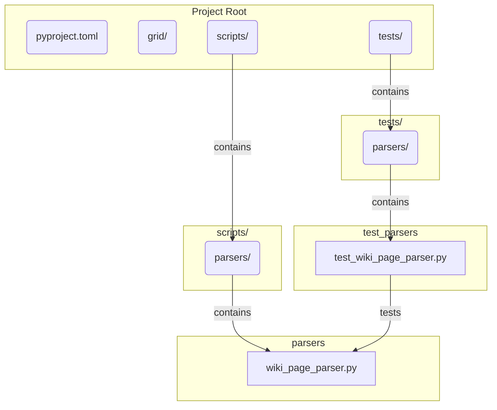

# 実装戦略：Danbooru Wikiページパーサー

**バージョン:** 1.0

## 1. 目的とゴール
このスクリプトの目的は、DanbooruのWikiページ（`lying`や`leg_up`など）のHTMLソースコードをインプットとして受け取り、後続のAI分析ステップで利用可能な、構造化されたJSONデータをアウトプットすることです。

**インプット:**
*   Danbooru WikiページのHTMLコンテンツ（文字列）
*   （将来的には）対象となるタグ名

**アウトプット:**
*   抽出された情報を含むJSONオブジェクト

## 2. 全体像とファイル構成
プロジェクト全体の保守性と拡張性を考慮し、データ収集・パース関連のスクリプトは、アプリケーション本体のロジック（`grid/`ディレクトリ）とは分離した`scripts/`ディレクトリに配置します。

-   **`scripts/parsers/wiki_page_parser.py`**:
    -   `DanbooruWikiPageParser`クラスを実装するメインファイル。HTMLを解析する責務を持ちます。
-   **`tests/parsers/test_wiki_page_parser.py`**:
    -   上記パーサーのユニットテストを記述するファイル。`pytest`フレームワークの利用を想定します。

## 3. 実装計画：`wiki_page_parser.py`

**クラス名:** `DanbooruWikiPageParser`

| メソッド名 | 抽出ロジック（CSSセレクタと処理） | 備考（`lying`と`leg_up`での検証） |
| :--- | :--- | :--- |
| `__init__(self, html_content)` | `self.soup = BeautifulSoup(html_content, 'html.parser')` | - |
| `parse(self)` | 全ての `_extract_...` メソッドを呼び出し、結果を一つの辞書に集約して返す。 | - |
| `_extract_tag_name(self)` | `self.soup.select_one('h1#wiki-page-title a').get_text(strip=True)` | `lying`, `leg_up` 共にこのセレクタでタグ名を取得可能。 |
| `_extract_wiki_description(self)` | `self.soup.select_one('div#wiki-page-body > p').get_text(strip=True)` | 最初の `p` タグを説明文と見なす。両方のHTMLで有効。 |
| `_extract_aliases(self)` | `p`タグの中から「The following tags are aliased to this tag:」というテキストを持つ要素を探し、その中の `a.wiki-link` を全て取得する。 | `lying`, `leg_up` 共にこの構造を持つため、リストとして抽出可能。 |
| `_extract_implicates_this_tag(self)` | `p`タグの中から「The following tags implicate this tag:」というテキストを持つ要素を探し、その中の `a.wiki-link` を全て取得する。 | `lying`には存在するが、`leg_up`には存在しない。要素が見つからない場合は**空のリスト**を返す堅牢な設計が必須。 |
| `_extract_see_also(self)` | `h4`タグの中から「See also」というテキストを持つ要素を探し、その**次**の `ul` 要素内の `a` タグを全て取得する。 | 両方のHTMLでこの構造（`h4` -> `ul`）が確認できるため有効。 |

## 4. テスト計画：`test_wiki_page_parser.py`

品質を担保するため、`pytest` を用いたテストを最初から作成します。

1.  **テストデータの準備**:
    -   提供された `lying` と `leg_up` のHTMLを、テスト用のディレクトリ（例: `tests/fixtures/`）に保存します。
2.  **テストケースの作成**:
    -   **`test_parse_lying_page`**: `lying`のHTMLをパースさせ、期待される全てのキー（`tag_name`, `wiki_description`, `aliases`, `implicates_this_tag`, `see_also`）と値が正しく抽出できていることをアサートします。
    -   **`test_parse_leg_up_page`**: `leg_up`のHTMLをパースさせ、`implicates_this_tag` が**空のリスト `[]` として**正しく返されることを含め、各情報が正確に抽出できることをアサートします。
    -   **`test_parse_invalid_html`**: 不正なHTMLや空の文字列を渡した場合に、例外を送出するか、あるいは安全に空のデータを返すかをテストします。