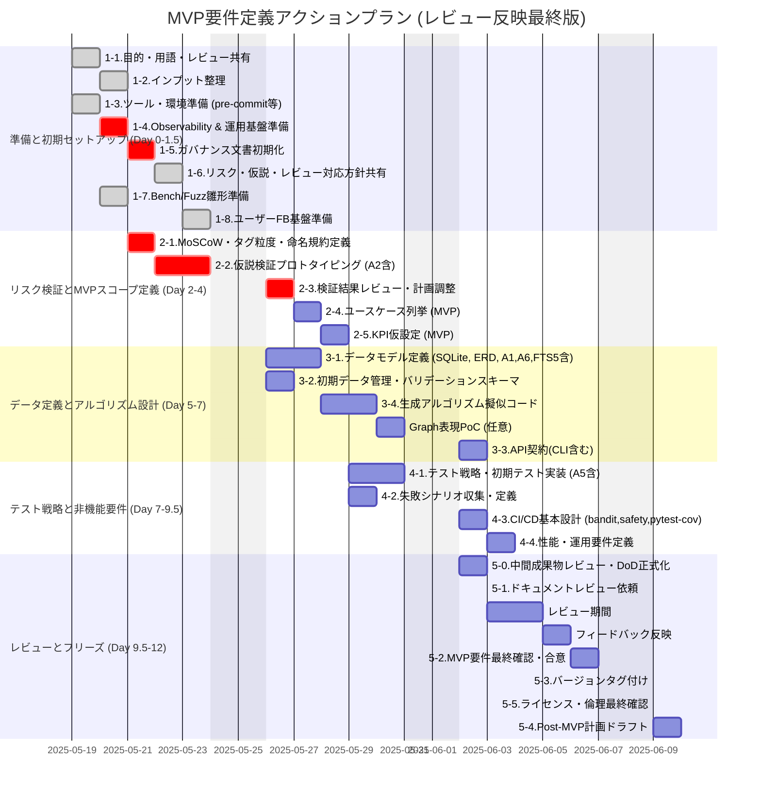

# 画像生成タグ管理プロジェクト MVPアクションプラン 

### 0. はじめに

本ドキュメントは、「画像生成におけるタグの依存関係/排他関係をデータベース的に管理し、構図的に破綻のないタグのランダムピック（あるいはランダマイザ）を作る」プロジェクトのMVP（Minimum Viable Product）の要件定義を2週間程度で固めるためのアクションプランと、その時点での設計思想をまとめたものです。

**プロジェクトの目的:** 構図的に破綻のない、かつ多様なタグの組み合わせを効率的に生成し、画像生成の試行錯誤を支援する。
**MVPのゴール:** 「姿勢」カテゴリのタグに限定し、基本的な依存・排他関係を考慮したランダムなタグセットを生成できるCLIツールを提供すること。加えて、この2週間スプリントを通じて、本アプローチの技術的な実現可能性（特にデータ定義の運用性と性能）、**[修正] プロジェクト推進のための基本的なガバナンス、データ品質担保の仕組み、初期のユーザフィードバック収集の足がかりを構築し、低コストの観察・統計・ガバナンスを先手で仕込むことで、MVP のままでも運用可能なプロトタイプに近づけること**も重要なゴールとします。

---

### 1. 準備フェーズ（Day 0-1.5）

| To-Do | 目的 | アウトプット/アクション | 担当目安 | 期間(d) |
| --- | --- | --- | --- | --- |
| **1-1. 目的と用語の共有** | プロジェクトビジョン、主要な用語（タグ、関係性、破綻等）の認識を合わせる。 | ・プロジェクト概要1Pager作成・共有 ・キックオフミーティング (該当者間) レビュー内容と本修正アクションプランの共有、合意形成を含む。 | 全員 | 0.5 |
| **1-2. インプット整理** | 既存のタグリスト、関連資料、過去のプロンプト例などを集約し、アクセス可能にする。 | ・共有リポジトリ/フォルダに資料を集約 ・タグリストの初期フォーマット確認 (例: テキスト、スプレッドシート、既存YAML等) ・`Tags Example`を元に、MVP対象「姿勢」カテゴリの初期タグ候補リスト作成 | リード | 0.5 |
| **1-3. ツール・環境準備** | 開発に必要な基本的なツール、コミュニケーションチャネルを整備する。 | ・Gitリポジトリ作成 ・タスク管理ツールセットアップ (例: GitHub Issues) ・コミュニケーションチャネル設定 (例: Slackチャンネル) ・`pre-commit` (`black`, `isort`, `ruff`, **`yamllint`**, **YAML重複キーチェック**) のセットアップ ・`poetry` or `pdm` の採用検討とセットアップ ・README に "Make ⚡️" (`make dev`等) の導入準備 | 開発担当 | 1.0 |
| **1-4. Observability & 運用基盤準備 (Review A1, A4)** | 早期のKPI検証、異常検知、障害復旧能力の確保。 | ・`generate_log`テーブルスキーマ定義 (SQLite用、`id, req_hash, duration_ms, success, err`等) と、ログ追記関数の雛形Pythonコード作成 ・`scripts/backup_db.sh` (SQLiteバックアップ用シェルスクリプト) の雛形作成と、`README.md`へのバックアップ・リストア手順記載箇所のプレースホルダ設定 | 開発担当 | 0.5 |
| **1-5. ガバナンス文書初期化 (Review A3 & 既存1-5, 1-6統合)** | OSSライクなガバナンスの早期定義と属人化防止、規約設定による手戻り防止。 | ・`CONTRIBUTING.md`, `CODE_OF_CONDUCT.md`, `CODEOWNERS`の初期テンプレート作成 ・`tag_naming_convention.md` の初版をリポジトリに配置 ・`OSS-LICENSES.md` に "著作権のあるキャラ名・商標を登録しない" ガイドラインを記載 ・「RACIマトリクス」を1枚で作成しリポジトリに置く (例: `docs/governance/raci_matrix.md`) | リード | 0.5 |
| **1-6. リスク・仮説検証・レビュー指摘事項対応方針共有ミーティング** | レビュー内容と初期リスク(H1-H3含む)をチームで共有し、仮説検証の進め方、判断基準等を合意。 | ・ミーティング議事録 ・仮説検証の具体的な手順と評価指標の素案 ・レビュー指摘「追加アクション」のトリアージ結果と対応優先度リスト ・**[追加] レビュー指摘『抜け落ちている視点』への対応方針（MVPスコープ／Post-MVPスコープの切り分け、理由付け含む）** | 全員 | 0.5 |
| **1-7. ベンチマーク & Fuzzテストの雛形準備** | CIでの警告を通じてテスト実装を促し、品質担保意識を初期から持つ。 | ・`pytest-benchmark` の導入と空のベンチマークテストファイル作成 ・Hypothesis の導入と、レビュー提案の「"同時選択で EXCLUDES を起こさない" プロパティ」テストの空実装をリポジトリにpush (`tests/property/test_core_properties.py` 等) | 開発担当 | 0.5 |
| **1-8. ユーザフィードバック基盤準備** | 早期からユーザの声を集める仕組みを用意する。 | ・GitHub Issue テンプレートに "タグ/関係性 提案 or 変更" 用フォームを用意 ・`examples/notebook_demo.ipynb` の雛形作成 (中身はMVP開発後半で記述) | リード | 0.5 |

---

### 2. リスク検証駆動型スコーピング & MVP仮決め（Day 2-4）

| アクション | 詳細 | 出力物 (例) | 担当目安 | 期間(d) |
| --- | --- | --- | --- | --- |
| **2-1. MoSCoW分類ワークショップ と タグ粒度・命名規約定義** | 提供された全タグリストや想定機能を Must/Should/Could/Won't に分類。  - **Must (MVP):** 「姿勢」カテゴリのごく一部の主要タグ（例：`Tags Example`の"Basic positions"から5-10個程度、明確な排他/依存関係を持つものを選定）と、それらに関する基本的な排他/依存関係の定義と処理、CLIによるタグセット生成。 - この段階で「タグの粒度基準」（例: "Crossed legs" は posture？legs？の判断基準）を明確化し、初期タグ候補リストをレビュー・絞り込み。 - `tag_naming_convention.md` (1-5で作成した初版) のレビューと更新。  - **Should以降**: 現状維持。 | `docs/requirements/moscow_classification.md` `docs/definitions/tag_granularity_guideline.md` `tag_naming_convention.md` (更新版) | 全員 | 1.0 |
| **2-2. 仮説検証プロトタイピング (H1, H2, H3, データ品質・多様性関連検証)** | **目的:** データ定義工数、ルール表現力、基本性能、データ品質維持、生成多様性の早期評価。 **(a) H1検証 (データ定義量・品質):** 2-1で選定したコアタグ（10-20個程度）と、それらの間の主要な排他・依存ルール（最低10-20ケース）をYAML形式で定義。作業負荷を実測。タグ定義フォーマット、ルール記述フォーマットを確定。この際、`tag_naming_convention.md` を参照し、初期タグの命名を行う。 **(a-2) H1追加検証 (メタデータ・スキーマ):** `tags` テーブルに含めるべき最小メタデータ項目（`nsfw_flag`, `source`, `license` 等）をYAMLに仮定義。`schemas/initial_tags.schema.json` を仮生成しVSCode YAML拡張等での簡易バリデーションを試行。 **(b) H2検証 (ルール表現力):** (a)で定義したルールが `EXCLUDES/REQUIRES/IMPLIES` の3種で十分に表現可能か、XOR関係や集合依存の必要性がないか評価。小規模なテストコードで検証。 **(c) H3検証 (性能):** (a)のYAMLデータをSQLiteに投入するシーディングスクリプトを作成。Pythonで基本的なDB読み出し、簡易的なタグ選択と排他判定ロジックを実行し、50ms/セットの処理時間を測定。測定範囲を明確にする。 **(d) YAML→DBマイグレート時の名称重複検知機能**をシーディングスクリプトに実装し検証。 **(e) H-extra検証 (履歴管理):** タグ廃止・改名 (`is_deprecated`, `deprecated_at`, `replaced_by_id`) をどのようにYAMLとDBで表現するか、簡単な方針を検討・記録。 **[追加] (f) H-quality検証 (多様性チェック - Review A2):** 選定したコアタグセットと生成ロジックのプロトタイプを用い、n=100～1000程度のタグセットを生成。タグ出現頻度をヒストグラム化し、簡易的なエントロピーを算出するCLIスクリプト (`scripts/check_diversity_simple.py`) のプロトタイプを作成 (`pytest-bench`雛形転用)。 | ・`prototypes/data/initial_tags_rules.yaml` ・`prototypes/scripts/yaml_to_sqlite_seeder.py` ・`prototypes/scripts/performance_benchmark.py` ・`prototypes/schemas/initial_tags.schema.json` (仮) ・**`scripts/check_diversity_simple.py` (プロトタイプ)** ・`docs/reports/hypotheses_validation_report_day4.md` (H1,H2,H3,H-extra,H-quality検証結果、課題、対応方針案) | 開発担当 | 2.0 |
| **2-3. 検証結果レビューと計画調整** | 2-2の検証結果レポートに基づき、MVPスコープ、KPI、タイムライン、技術選択の妥当性をチームでレビューし、必要であれば計画を修正する。 | ・ミーティング議事録 ・修正されたアクションプラン (必要な場合) | 全員 | 1.0 |
| **2-4. ユースケース列挙 (MVP)** | 2-3の結果を踏まえ、MVPで実現する主要なユースケースを具体化する。 | `docs/requirements/use_cases_mvp.yaml` | リード | 0.5 |
| **2-5. 成功指標 (KPIs) の仮設定 (MVP)** | 2-3の結果を踏まえ、KPIを現実的な範囲で再設定。 ‐ **生成成功率:** ≥ 90% ‐ **生成速度 (単一生成):** ≤ 50ms ‐ **カバレッジ (関係性):** MVP対象の主要タグ間の明白な物理的破綻関係が最低10-20ケース以上定義・テストされている。 ‐ **データ品質KPI (初期):** YAMLバリデーション成功率100%、命名規則違反0件。 **[追加] ‐ 運用KPI (初期):** 「生成コール数」「生成失敗率」「平均/95パーセンタイル処理時間」（`A1`のログに基づき計測） | `docs/requirements/kpi_mvp.md` | リード | 0.5 |

---

### 3. データモデル & インターフェース定義（Day 5-7）

| アクション | 詳細 | 出力物 (例) | 担当目安 | 期間(d) |
| --- | --- | --- | --- | --- |
| **3-1. データモデル定義 (SQLite - MVP版)** | 2-2, 2-3の結果を踏まえ、テーブル構造、カラム、データ型、リレーションを確定。 ・**`tags`**: `id`, `name` (unique), `category`, `parent_id`, `description`, `weight` (デフォルト1.0、0禁止), `priority` (将来用、重みと分離), `nsfw` (bool), `origin` (enum), `license` (text), `is_deprecated` (bool), `deprecated_at` (timestamp), `replaced_by_id` (FK to `tags.id`), **[追加] `lang` (TEXT, nullable), `canonical_id` (INTEGER, FK to `tags.id`, nullable) (Review A6)**  ・**`relations`**: `id`, `tag_a_id`, `tag_b_id`, `type` (enum `EXCLUDES`, `REQUIRES`, `IMPLIES`) , `strength`, `description`   ・**`schema_info`**: `version` (text), `updated_at` (timestamp)   ・**`synonyms`**: `id`, `tag_id` (FK to `tags.id`), `name` (text, unique)   **[追加]** ・**`generate_log`**: `id`, `request_hash`, `duration_ms`, `success`, `error_message`, `created_at` (Review A1)  ・将来の「複合関係」の可能性をコメント明記。「不可逆排他」と「状況依存排他」の区別方法を定義。 ・Mermaid ER図自動生成スクリプト (`schemaspy`等) の導入検討と、手動での初期ER図作成。CIでの自動更新はPost-MVP検討。 **[追加]・SQLite FTS5インデックス定義:** `CREATE VIRTUAL TABLE tags_fts USING fts5(name, content='tags', content_rowid='id');` をスキーマ定義に含める。 | `docs/schema/er_diagram_mvp.mmd` (Mermaid) `docs/schema/tables_mvp.md` **[追加] `README.md`に`weight`カラムの扱いルールを記載** | 開発担当 | 1.5 |
| **3-2. 初期データ管理方法定義とバリデーションスキーマ正式化** | MVPのタグと関係性データを初期はYAMLファイルで管理。2-2(a)で固めたフォーマットを正式版とする。 YAMLからSQLiteへの初期データ投入（シーディング）スクリプトの仕様を確定(2-2(c)の成果物をベースとする)。 YAMLに `schema_version` を記述するルールを定める。 ・`schemas/initial_tags.schema.json` を正式版として定義・配置。VSCode等でのリアルタイムバリデーションに活用。 **[追加]**・シーディングスクリプトにYAML→DBマイグレート失敗時の基本的なエラーハンドリングと、手動ロールバック手順のドキュメント化への参照を含める。 | `docs/schema/initial_data_format.yaml` (例) `docs/schema/seeding_spec.md` `scripts/seed_database.py` (2-2(c)からの発展版) `schemas/initial_tags.schema.json` (正式版) | 開発担当 | 1.0 |
| **3-3. API契約 (FastAPI - CLIラッパー想定)とCLIインターフェース** | CLIの内部処理や将来的なAPI化を見据え、主要な処理のインターフェースをFastAPIのPydanticモデルとして定義。 ・`/generate (POST)`: `categories_to_include`, `num_sets` 等をリクエスト、タグセットリストをレスポンス。 ・(内部関数として) `get_tag_by_id`, `get_relations_for_tag` 等。 ・CLIのオプションとして `--seed <integer>` を追加し、乱数の再現性を担保する仕様を定義。 ・失敗理由を返すUX (`GenerationError(details=list[str])`) をAPIレスポンスとCLI出力に含める設計。 **[追加]**・ドキュメントに「将来の画像生成UIとの連携を考慮し、呼び出しインターフェースは極力シンプルかつ汎用的に設計する」方針を明記。 | `docs/api/openapi_mvp.yaml` (またはPydanticモデル定義のPythonファイル) `docs/cli_interface.md` | 開発担当 | 1.0 |
| **3-4. 生成アルゴリズム擬似コード (MVP版)** | 3ステップ（抽選→排他判定→依存補完）を具体化。 ・レビュー指摘の「失敗時リカバリ」設計（`max_attempts`やバックトラック深さのハードリミット、CPUを焼かないための時間制限、生成不能時の「部分セット提示＋警告」or エラー終了等のUX）を明記。 ・「優先度付きルール処理」の設計（`strength`の具体的な扱い、確率的無視や重み減算のアイデア）を盛り込む。 ・バッチ生成時の「重複回避」方針を決定（アルゴリズムで保証するか、許容するか）。 ・`networkx` 等のGraph表現の試行的利用について、Day-5等で2h程度のPoCタイムボックスを設けることを検討（デバッグ効率向上のため）。 ・`weight` カラムの扱い（デフォルト=1.0、0禁止）をアルゴリズム仕様にも反映。 | `docs/logic/algorithm_mvp.md` `docs/poc/graph_representation_poc_plan.md` (実施する場合) | 開発担当 | 1.5 |

---

### 4. 非機能要件 & テスト戦略（Day 6-9）

| アクション | 詳細 | 出力物 (例) | 担当目安 | 期間(d) |
| --- | --- | --- | --- | --- |
| **4-1. テスト戦略定義 (MVP版) と初期テスト実装** | 単体テスト、(CLIとしての)結合テスト、プロパティベーステストの適用範囲と方針を定義。 ・**単体テスト**: コアロジックの検証。 ・**結合テスト**: CLI実行と期待出力の検証。 ・**プロパティベーステスト**: Day-7までに `Hypothesis` 等を用いたテストの導入を目指す。1-7で作成した雛形に、データモデル定義後、スキーマ不備やロジックの普遍的性質（例: 排他関係にあるタグペアが同時に出現しない）の検証を開始。 ・レビュー指摘の「タグ間排他テーブルをそのままpytestのparametrizeに流し込むテンプレート」の作成方針を記述。 ・カバレッジ閾値 (Line 80%未満fail) をCI設定案に含める。 ・自動整合性チェック (`scripts/check_integrity.py`) のプロトタイプ作成と手動実行。内容は循環依存、非対称排他、**[追加] (A REQUIRES B) と (A EXCLUDES B) のSAT不可能系検出ロジック**など。 ・対称性チェッカーの必要性をテスト戦略に明記し、CIへの組み込みを計画。 **[追加タスク] Resilienceテスト計画・準備 (Review A5):** 生成APIを対象に、100並列呼び出し等の負荷をかけ、95パーセンタイル応答時間を計測するテストスクリプト (`tests/resilience/test_api_load.py`) の雛形作成と、テスト実施計画を策定 (`0.5d`、3-4のアルゴリズム設計と並行または後続で実施、実際の実行はMVP実装後でも可)。 | `docs/tests/test_strategy_mvp.md` `tests/templates/pytest_parametrize_example.py` `scripts/check_integrity.py` (プロトタイプ) CI設定案にカバレッジ閾値、対称性チェッカー計画を記述 **[追加] `tests/resilience/test_api_load.py` (雛形)** | 開発担当 | 1.5 |
| **4-2. 失敗シナリオ収集・定義** | MVPスコープ内で想定される「構図的破綻」の具体的な失敗シナリオをリストアップ。これらはテストケースのベースとなる。 | `docs/tests/failure_scenarios_mvp.md` | リード | 0.5 |
| **4-3. CI/CDの基本設計** | GitHub Actions等を用いた基本的なCI（テスト自動実行、Lintチェック）の設計。 ・CIジョブに `bandit`, `safety` を追加。 ・CIジョブに `pytest --cov` を追加。 ・CIジョブに `pytest-benchmark` を組み込む準備 (PR単位での性能退化検知はPost-MVP目標、まずは手動実行可能な状態に)。 ・CIジョブで `scripts/check_integrity.py` を実行する計画 (MVPでは手動、将来的に自動化)。 ・CIにER図自動更新の導入をPost-MVPで検討。 | `.github/workflows/ci_basic.yml` (案) | 開発担当 | 1.0 |
| **4-4. 性能・運用要件定義** | MVPとしての性能目標（2-5. KPI参照）、ログの方針、依存ライブラリの選定方針。 ・CLI出力形式ごとの拡張子自動判定 or 明示オプションの方針を決定。 ・サンプリング先読み/キャッシュ (同一シード＋カテゴリ条件なら2回目はキャッシュ) を性能要件として検討・記載。 ・Graph表現移行の可否判断基準 (PoC結果の指標、ノード数 >1e3 & 平均次数>8 等) をdocsに残す。 **[追加]**・ログの方針に「設定ファイル経由での`loglevel`指定オプションを標準実装する」ことを明記。 **[追加]**・データバックアップ方針について、`A4`で作成したスクリプトと手順書へのリンクを記載。 | `docs/requirements/non_functional_mvp.md` | リード | 1.0 |

---

### 5. MVP 要件レビュー & フリーズ（Day 10-12）

| アクション | 詳細 | 完了判定/アウトプット | 担当目安 | 期間(d) |
| --- | --- | --- | --- | --- |
| **5-0. 中間成果物レビューとDefinition of Done (DoD) 正式化** | データモデル定義、アルゴリズム擬似コード、テスト戦略定義など、主要な設計ドキュメントが固まった段階で一度チーム内レビューを実施。早期にフィードバックを得て手戻りを防ぐ。 ・このタイミングでDefinition of Done (DoD) チェックリストを正式化し、リポジトリに配置。スコープクリープを防ぐ。 | ・レビューコメントと対応状況 `docs/governance/definition_of_done_mvp.md` | 全員 | 1.0 |
| **5-1. ドキュメントレビュー** | 作成された全ドキュメントを関係者レビュー。Day 10にレビュー依頼、Day 11-12をレビュー期間とし、Day 13にフィードバック反映。 (レビュー期間を実質2日以上確保) | 全てのレビューコメントがResolve済み。 | 全員 | 3.0 |
| **5-2. MVP要件最終確認・合意** | レビュー済みの要件に基づき、MVPで開発する範囲、優先順位についてDay 13に最終確認、Day 14に合意。 | 関係者による承認。 | 全員 | 0.5 |
| **5-3. バージョンタグ付け** | 合意された要件定義ドキュメント群に対し、Gitリポジトリにバージョンタグを付与（例: `v0.1-mvp-spec`）。 | Gitタグ付与。 | リード | 0.25 |
| **5-4. Post-MVP移行計画ドラフト** | MVP後の拡張フェーズ（P1: SQLite本格運用、P2: カテゴリ拡張・UIプロト、P3: GraphDB・ソルバー導入）への技術選択肢、リスク、課題を整理。 ・YAMLスパゲッティ対策 (フォルダ分割 or 1行=1タグ CSVへの移行指針) を含める。 ・Streamlit 1画面デモの計画を具体化。 **[追加]**・`Review`の「ポストMVPの Backlog に追記」項目（本格的なi18n拡張、Sentry導入、mkdocsサイト、ダッシュボードUI）を具体的にリストアップ。 **[追加]**・運用セキュリティ強化（RBAC導入検討、APIキー管理システム検討、定期脆弱性診断計画）。 **[追加]**・外部連携インターフェース戦略（バージョン管理戦略、主要UIへのプラグイン開発可能性検討）。 **[追加]**・スキーマ管理高度化 (`scripts/diff_schema.py`作成検討)。 | `docs/roadmap/post_mvp_plan_draft.md` | リード | 1.0 |
| **5-5. ライセンス・倫理関連事項の最終確認** | MVP開発開始前に、法務・倫理面での遵守事項を再確認する。 | ・`OSS-LICENSES.md` および `nsfw`フラグとCLIオプション仕様の最終確認。 | リード | 0.25 |

---

### 6. 拡張を見据えた設計（ガードレール - MVP開発中に意識すること）

| 観点 | MVPでの対応 (例) | 拡張時の布石 |
| --- | --- | --- |
| **DB可搬性** | SQLAlchemy Core (またはSQLModel) をORMとして採用し、直接SQL記述を避ける。**[追加] 具体的な`AbstractRepository`パターンの設計指針をドキュメント化。** | `AbstractRepository` パターンを導入し、DBエンジンごとの実装を差し替えられるようにする（Neo4j等への移行を容易に）。 |
| **タグ増殖対策** | `tags.name` の一意性を担保。プリフィックス (`posture_*`) 等で命名規則を設ける (`tag_naming_convention.md` に従う)。YAML管理段階から。 | `synonyms` テーブルスキーマを初期から用意。将来の同義語・類似語マッピングや多言語対応の準備。 |
| **制約ソルバー導入** | アルゴリズム内で、複雑な制約チェックが必要になった場合にエラーまたは警告を出す程度に留める。 | 将来的に制約ソルバーに渡すためのインターフェース関数（ダミー実装で良い）を用意しておく (`solve_constraints_with_solver()`など)。 |
| **UI連携** | CLIの出力をJSON/CSVなど機械処理しやすい形式にする。FastAPIのスキーマをOpenAPIとしてエクスポート可能に。 | OpenAPI定義からSwagger UI/Redoc等のAPIドキュメントが自動生成されるように設定。将来のWeb UIバックエンドとして利用可能。 Streamlit 1画面デモ (DB → 生成 → タグリスト表示) をMVP後または余力があればMVP期間の最後に作成。 |
| **関係性定義の負担** | YAMLでの手動定義。コメントで理由を付記。 | 関係性の可視化ツール (P2検討) や、半自動的な関係性候補提示機能のアイデアをストックしておく。 `networkx` 等での可視化PoCも布石となりうる。 |
| **データ品質維持** | **[修正・強化]** YAML Lint + JSONSchema による手元およびCIでのバリデーション。`scripts/check_integrity.py` の定期的な実行とCIへの組み込み計画。タグ廃止／改名の履歴管理 (`is_deprecated`, `deprecated_at`, `replaced_by_id`) を`tags`テーブルに実装し、運用ルールを定める。`tag_naming_convention.md` の徹底。 | 将来的にはタグ提案時の機械的チェックも検討。 |
| **ガバナンス** | **[修正・強化]** RACIマトリクス、Definition of Done をリポジトリに配置・運用。タグ提案・変更のワークフローをGitHub Issueテンプレートで定義。 | コア開発者が"タグDBの門番"になる属人化を避け、複数人でのレビュー体制や自動チェックを強化する。 |
| **[新規] ログ活用** | **[追加]** `A1`で設計したイベントログと、構造化ログを基本とする。ログレベル設定を可能にする。 | ログを活用したデバッグ効率化、KPI監視、異常検知メカニズムの段階的導入。 |

---

### 7. 参考タイムライン（Ganttイメージ - 2週間スプリント、約12営業日想定）

*上記ガントチャートは目安であり、タスクの依存関係とチームの状況に応じて柔軟に調整してください。Day 0は2025-05-19と仮定しています。準備フェーズの追加タスク(1-4, 1-5)により、準備フェーズ全体が0.5日後ろ倒しになっています。後続タスクの開始日もそれに伴い調整しています。*

-----

### 8. 参考テンプレート/フォーマット（リポジトリ内に用意）

  * `/docs/templates/moscow_template.md`
  * `/docs/templates/use_case_template.yaml`
  * `/src/models/pydantic_schemas_template.py` (FastAPI Pydanticモデル雛形)
  * `/tests/templates/test_edge_case_template.py` (pytestでのエッジケース記述用)
  * `initial_data_example.yaml` (タグ・関係性定義のYAML具体例)
  * `/docs/templates/hypotheses_validation_report_template.md`
  * `/tests/templates/property_based_test_example.py`
  * `/docs/templates/raci_matrix_template.md`
  * `/docs/templates/definition_of_done_template.md`
  * `/.github/ISSUE_TEMPLATE/tag_proposal_template.md` (タグ提案用Issueテンプレート)
  * `/schemas/initial_tags.schema.json` (YAMLバリデーション用JSON Schemaの初期版)
  * **[新規]** `/.env.example` (Sentry DSN等の将来的な設定項目プレースホルダを含む)

-----

この最終アクションプランにより、MVP開発のスピード感を維持しつつ、レビューで指摘された将来の課題への対策を初期段階から織り込むことを目指します。特に、「軽量タスクの優先的取り込み」と「バックログ化による次スプリントへの接続」を意識し、期間内で最大限の成果を出すことを重視します。